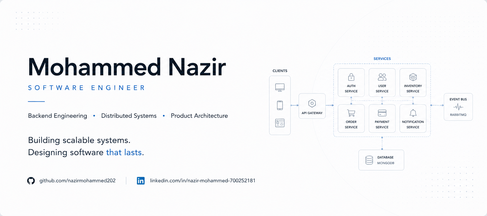

  

  

### Senior Software Engineer • Backend Architecture • Distributed Systems

Designing scalable software systems that power real-world products—from multi-tenant SaaS platforms and IoT ecosystems to distributed backend services and mobile applications.

[LinkedIn](https://linkedin.com/in/nazir-mohammed-700252181) •
Email: nazirmohammed202@gmail.com

---

# Engineering Highlights

- 🏗 Designed and built **Wasteknot**, a multi-tenant SaaS platform serving 56 organizations.
- 📱 Built **ScrapTrade**, a marketplace with **100,000+ Android downloads**.
- 🔐 Designed a centralized authentication platform used across multiple production applications.
- ⚡ Built event-driven backend services using RabbitMQ.
- 📡 Architected an IoT platform using MQTT for real-time communication between hardware and cloud services.
- ☁️ Designed and deployed production infrastructure on AWS.
- 👥 Led an engineering team of up to 16 developers while remaining hands-on in architecture and development.

---

# Engineering Philosophy

I enjoy solving engineering problems where reliability, maintainability, and scalability matter.

Most of my work has involved designing systems rather than individual applications—breaking complex business problems into simple, maintainable software that can evolve over time.

When building software I optimize for:

- Simplicity
- Scalability
- Reliability
- Clear Architecture
- Developer Experience
- Long-term Maintainability

---

# Featured Projects

## ♻️ Wasteknot

A multi-tenant SaaS platform connecting recyclers, traders, aggregators and transporters.

**Highlights**

- Event-driven architecture
- RabbitMQ messaging
- React & React Native applications
- REST APIs
- MongoDB
- AWS deployment
- Role-based access control
- Logistics management

---

## 📱 ScrapTrade

Marketplace for buying and selling recyclable materials.

**Highlights**

- 100,000+ Android downloads
- Daily market price updates
- Marketplace architecture
- User verification
- Admin dashboard

---

## 📡 Metabin

IoT-enabled smart recycling platform integrating hardware and cloud systems.

**Highlights**

- MQTT communication
- Arduino integration
- QR & Barcode scanning
- Device provisioning
- Mobile applications
- Analytics dashboard

---

## 🔐 Authentication Platform

A centralized identity platform powering multiple enterprise applications.

Features include:

- JWT Authentication
- Role-Based Access Control
- Shared Identity
- Token Validation
- Application Authorization

---

# Current Focus

I'm currently working on:

- 🧾 VixPOS
- 🏗 Public Engineering Portfolio
- ⚙️ Distributed Systems Examples
- 📚 System Design Documentation
- ☁️ Cloud Architecture

---

# Core Expertise

### Backend

Node.js • TypeScript • Express • MongoDB • PostgreSQL • RabbitMQ • Redis

### Frontend

React • Next.js • React Native

### Infrastructure

AWS • Docker • Linux • PM2 • Nginx

### Architecture

Distributed Systems • Multi-tenant SaaS • REST APIs • Authentication • MQTT • System Design

---

# What You'll Find Here

This GitHub contains:

- Production-inspired projects
- System design notes
- Backend architecture examples
- Engineering experiments
- Technical documentation
- Lessons learned from building production systems

---

### Thanks for stopping by.

I'm always interested in discussing software architecture, distributed systems, and building products that solve real-world problems.

